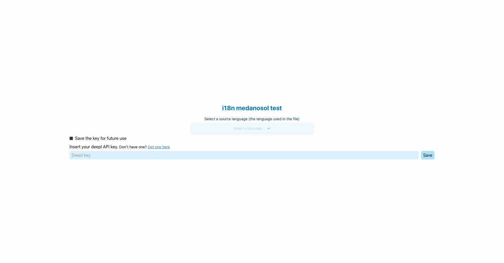

<div align="center"><strong>medsol-i18n</strong></div>
<div align="center">The easiest way to translate your i18n files<br /></div>
<br />
<div align="center">
<a href="https://react.email">Website</a> 
<span> · </span>
<a href="https://github.com/resendlabs/react-email">GitHub</a> 
</div>

## Introduction

medsol-i18n is a tool that allows you to translate your i18n files in a simple and fast way. You can manually translate the files or use the Deepl API to translate them automatically.

## Why

The idea of this tool is to facilitate the translation of i18n files, since it is a tedious task to do it manually. As devs, we are always looking for ways to automate tasks and this is one of them.

## Install

Install the package using your favorite package manager.

#### With yarn

```sh
yarn add medsol-i18n --dev
```

#### With npm

```sh
npm install medsol-i18n -D
```

## Getting started

Once you have installed the package, add the following command to your package.json file.

```json
"scripts": {
  "translate": "medsol-i18n"
}
```

Then, when you run the command `yarn translate` or `npm run translate`, the tool will start at port 3000 by default. You can change the port by adding the following command to your package.json file.

```json
"scripts": {
  "translate": "medsol-i18n --port 3001"
}
```

## Setting up the Deepl API

To use the Deepl API, you need to create an account on their website and get an API key. You can create an account here: [Deepl API](https://www.deepl.com/pro.html?cta=header-prices/). Their free plan allows you to translate 500,000 characters per month, so for most projects it will be more than enough.

## How to use

You just need to add the API key before you start trasnlating your files. If you want to skip doing this every time you open the tool, we added a way to save your API key in the browser's local storage. To do this, just click on the "Save API Key" button and the next time you open the tool, it will automatically load your API key. It's encrypted, so don't worry about security. If you still don't feel safe, you can always delete it from the local storage and add it manually every time you open the tool.

## Supported languages

Manually, you can translate your i18n files to any language you want. But if you want to use the Deepl API, you can only translate languages listed on the Deepl API Documentation: [Deepl API Docs](https://www.deepl.com/docs-api/translate-text/translate-text/)

## Contributing

- [Contribution Guide](https://react.email/docs/contributing)

## Authors

- Bu Kinoshita ([@bukinoshita](https://twitter.com/bukinoshita))
- Zeno Rocha ([@zenorocha](https://twitter.com/zenorocha))

## License

MIT License
